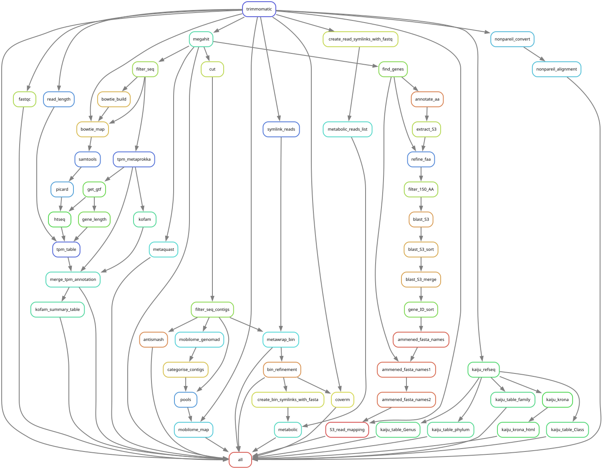

# Microbiome Workflow Toolkit

A collection of research bioinformatics workflows developed for high-throughput analysis of environmental microbiomes on HPC infrastructure.

The toolkit integrates sequencing quality control, metagenome assembly, genome reconstruction, taxonomic classification, functional annotation and gene abundance/expression profiling.

## Workflow architecture



## Workflow Modules

The toolkit comprises modular Snakemake workflows covering metagenomic and metatranscriptomic analysis, from raw sequencing reads to genome reconstruction, functional annotation and abundance profiling. Individual workflows can be enabled or disabled through configuration files according to the analytical requirements of each project.

### 1. Read Processing and Assembly

**Assembly — metaSPAdes (`assemble.smk`)**

Processes paired-end metagenomic reads using Trimmomatic for adapter removal and quality trimming, followed by FastQC for read-quality assessment. Quality-filtered reads are assembled using metaSPAdes, with subsequent contig filtering and assembly-quality assessment using MetaQUAST.

**Assembly — MEGAHIT (`assemble_megahit.smk`)**

An alternative assembly workflow designed for large and complex metagenomic datasets. Integrates Trimmomatic, FastQC and MEGAHIT using the `meta-large` preset, followed by contig filtering and MetaQUAST assessment.

### 2. Genome Reconstruction and Taxonomy

**Prokaryotic MAG Reconstruction (`mags.smk`)**

Reconstructs metagenome-assembled genomes (MAGs) using metaWRAP, integrating MetaBAT2, MaxBin2 and CONCOCT for genome binning and refinement. Refined MAGs are classified using GTDB-Tk, while CoverM estimates genome coverage through read mapping.

**Eukaryotic Genome Reconstruction (`mags_euk.smk`)**

Targets the recovery of eukaryotic genomic sequences from metagenomic assemblies. EukRep separates putative eukaryotic and prokaryotic contigs, followed by CONCOCT binning through metaWRAP and taxonomic assignment of recovered bins using CAT/BAT.

**Taxonomic Profiling (`kaiju.smk`)**

Performs protein-level taxonomic classification of quality-filtered metagenomic reads using Kaiju and the `nr_euk` reference database. Generates community-composition summaries at multiple taxonomic ranks, including phylum, class, family and genus, alongside interactive Krona visualisations.

**Standalone Taxonomic Profiling (`kaiju_only.smk`)**

Provides a standalone implementation of Kaiju for taxonomic profiling of previously processed sequencing reads. Generates taxonomic abundance tables at multiple ranks without requiring the assembly workflow or additional downstream analyses.

### 3. Functional Annotation and Abundance

**Alternative Gene-Abundance Workflow (`tpm_1.smk`)**

Quantifies gene abundance through read mapping and functional annotation of metagenomic assemblies. Integrates MetaProkka, KofamScan, Bowtie2, SAMtools, Picard and HTSeq to generate gene counts and transcripts-per-million (TPM) values, with annotated gene-level and KEGG Orthology abundance tables. This incorporates non-stranded gene counting with HTSeq and configurable temporary storage for Picard. Retains the core annotation, mapping and abundance calculations while accommodating different sequencing data and computational requirements.

**Metabolic Reconstruction (`metabolic.smk`)**

Characterises the metabolic potential of reconstructed microbial genomes using METABOLIC-C. Integrates refined MAGs with metagenomic read data to investigate microbial metabolic pathways and their associated abundance.

** Ribosomal gene Abundance (`s3_abundance3.smk`)**

Uses the S3 ribosomal protein, rpsC, as a phylogenetic marker for taxonomic abundance profiling. Combines Prodigal, KofamScan, BLAST and GTDB taxonomy to identify and classify S3 sequences, followed by CoverM read mapping to quantify their abundance within metagenomic samples.

### 4. Specialised Analyses

**Viral Identification (`viruses.smk`)**

Identifies viral sequences within metagenomic assemblies using geNomad. Performs sequence classification and score calibration to support the detection and characterisation of viral genetic elements within environmental microbiomes.

**Mobilome Characterisation (`mobilome.smk`)**

Characterises mobile genetic elements within metagenomic assemblies using geNomad. Separates contigs into chromosomal, viral, plasmid and unclassified categories, then uses SeqKit and CoverM to extract sequences and estimate their relative abundance across the metagenomic dataset.

**Biosynthetic Gene Clusters (`bgc.smk`)**

Identifies and characterises biosynthetic gene clusters within metagenomic assemblies using antiSMASH. Incorporates gene prediction and known-cluster comparisons to investigate the biosynthetic potential of environmental microbial communities.

**Metagenomic Diversity (`diversity.smk`)**

Estimates metagenomic sequencing coverage and sequence diversity using Nonpareil. Integrates k-mer-based and alignment-based analyses to evaluate sequencing redundancy and estimate the extent to which microbial community diversity has been sampled.

## General usage

Ensure all the following commands are done from the bioinformatics toolkit directory, to get to this use. 
```
cd /mnt/seaes01-data01/nixon-microbiome/shared/bioinformatic_toolkit
```
Note - a drawback to the current setup is that only one person can run the toolkit at one time though an unlimited number of samples can be run.

----------------------
## FOR USE ON THE SERVER 

Create a snakemake environment (only needs to be created once, the environment persists when logging off).
```
conda env create -n snakemake --file Snakemake.yaml
```
Type "y" when prompted and press enter.

Activate the snakemake environment (this needs to be done every time you log in).
```
conda activate snakemake
```
Leave your raw data in its origional folder, do not duplicate. 
Stage your files in /mnt/seaes01-data01/nixon-microbiome/shared/bioinformatic_toolkit/symlink_staging using a symlink. 
#see example scripts in the all_symlink_scripts folder
```
ln -s <full filepath and filename>_1.fastq.gz /mnt/seaes01-data01/nixon-microbiome/shared/bioinformatic_toolkit/symlink_staging/<new file name>_1.fastq.gz
ln -s <full filepath and filename>_2.fastq.gz /mnt/seaes01-data01/nixon-microbiome/shared/bioinformatic_toolkit/symlink_staging/<new file name>_2.fastq.gz
```
Modify the config.yaml, choose the directory of your data, your samples (symlinks), and number of cores to use. 
```
nano config.yaml 
```
Escape the file editor by pressing and holding "control" then pressing "x".

Create a screen so the workflow can run in the background and not terminate when logging off (note, you cant scroll in a screen).
```
screen -r snakemake
```
Activate snakemake again, if this fails you may need to use "source ~/.bashrc" first.
```
conda activate snakemake
```
Run the workflow run by typing the following into the terminal.
```
bash bash_script
```
Exit the tethered screen by pressing "control" "a" and "d" simultaniously.

-------------------
## FOR USE ON THE CSF

Create a snakemake environment (only needs to be created once, the environment persists when logging off).
```
module load apps/python/miniconda3/4.10.3
conda env create -n snakemake --file Snakemake.yaml
```
Leave your raw data in its original folder, do not duplicate. 
Stage your files in /mnt/seaes01-data01/nixon-microbiome/shared/bioinformatic_toolkit/symlink_staging using a symlink. 
#see example scripts in the all_symlink_scripts folder

Modify the config.yaml (further instructions in the file on how to modify), choosing the directory of your data, your samples, and number of cores to use. 
```
nano config.yaml
```
Escape the file editor by pressing and holding "control" then pressing "x".

Submit the job script to start the run. 
```
qsub qsub_jobscript
```
-----------------
## TROUBLESHOOTING

Have you forgotten to activate the snakemake environment?

Are you running the job from the correct directory? bioinformatics_toolkit/

Is someone else running the pipeline at the moment? Snakemake can't run twice, simultaneously, on the same output folder.

Has the job cancelled for whatever reason and snakemake has locked the folder?
```
snakemake --unlock <path/to/directory>
```
The script only recognises input data with the format _1.fastq.gz and _2.fastq.gz
